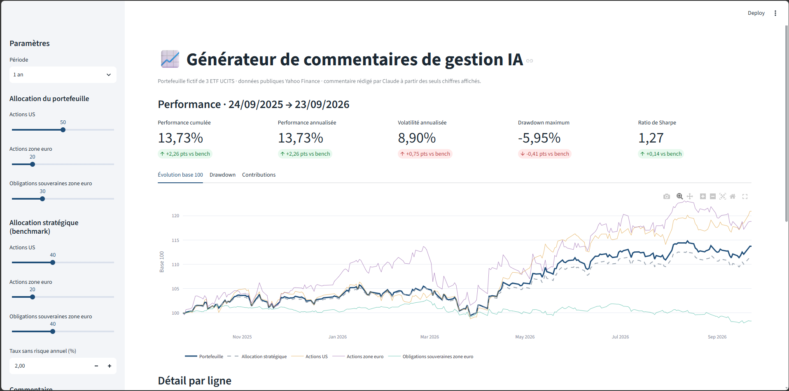
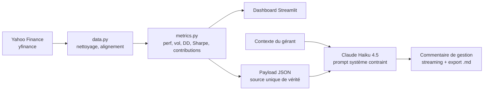

<div align="center">

# 📈 Générateur de commentaires de gestion IA

**Du reporting chiffré au commentaire de gestion rédigé, en un clic.**

[](https://ai-portfolio-commentary.streamlit.app)


[](https://github.com/FKP-Codes/Financial_Commentary/actions)


[**▶ Démo en ligne**](https://ai-portfolio-commentary.streamlit.app) · [Cas d'usage](#-cas-dusage-métier) · [Architecture](#-architecture) · [Lancer en local](#-lancer-en-local)



</div>

---

## 🎯 Cas d'usage métier

Chaque fin de mois, les équipes de gestion et de reporting d'une société de gestion rédigent des dizaines de
**commentaires de gestion** pour les reportings clients, les factsheets et les comités. L'exercice est
chronophage, répétitif et exige de la rigueur : chaque chiffre cité doit correspondre exactement au reporting.

Cette application montre comment un LLM peut produire un **premier jet** que le gérant n'a plus qu'à relire :

| Étape | Avant | Avec l'outil |
|---|---|---|
| Collecte des performances | Extraction manuelle, Excel | Automatique (yfinance) |
| Calcul des indicateurs de risque | Macros VBA / Excel | Python, testé unitairement |
| Rédaction du commentaire | 30 à 45 min par fonds | ~10 s de génération + relecture |
| Cohérence chiffres / texte | Contrôle visuel | Le LLM ne reçoit **que** les chiffres calculés |

### Choix de conception pour un usage en production

- **Zéro hallucination de chiffres** : le modèle reçoit un payload JSON contenant uniquement les métriques
  calculées ; le prompt système lui interdit d'inventer des événements de marché ou des statistiques. Le payload
  est affiché dans l'app pour audit.
- **Gérant dans la boucle** : un champ « contexte de marché » permet au gérant d'apporter sa lecture macro, que le
  modèle intègre sans l'enrichir de faits inventés.
- **Attribution de performance** : contributions par ligne et écarts d'allocation vs allocation stratégique, pour
  que le commentaire explique la performance relative et ne se contente pas de la décrire.
- **Paramétrage du ton** : institutionnels vs clientèle privée, trois longueurs.
- **Maîtrise des coûts** : Claude Haiku 4.5 (rapide, peu coûteux), limite de générations par session sur la démo
  publique, possibilité d'utiliser sa propre clé.

> ⚠️ Portefeuille **fictif**, construit uniquement à partir de **données publiques** (Yahoo Finance). Aucune donnée
> confidentielle ou propriétaire. Ne constitue pas un conseil en investissement.

---

## 📊 Fonctionnalités

- Portefeuille de 3 ETF UCITS cotés en EUR (Xetra) : **S&P 500**, **Euro Stoxx 50**, **obligations souveraines zone euro**
- Allocation du portefeuille et allocation stratégique (benchmark) paramétrables
- Périodes : YTD, 1 an, 3 ans, personnalisée
- Indicateurs : performance cumulée et annualisée, volatilité, drawdown maximum, ratio de Sharpe, tracking error
- Graphiques interactifs : base 100, drawdown, contributions à la performance
- Tableau par ligne : poids initial / actuel (dérive) / benchmark, performance, risque, contribution
- Commentaire de gestion en streaming, structuré en 4 sections, exportable en Markdown

---

## 🏗 Architecture

```
portfolio-commentary-generator/
├── app.py                  # Interface Streamlit (dashboard + génération)
├── src/
│   ├── config.py           # Univers d'investissement, allocations, modèle
│   ├── data.py             # Récupération et nettoyage des prix (yfinance)
│   ├── metrics.py          # Indicateurs de performance/risque (fonctions pures)
│   └── commentary.py       # Prompt système, payload JSON, appel Claude en streaming
├── tests/test_metrics.py   # Tests unitaires (pytest)
├── scripts/refresh_sample.py  # Snapshot CSV de secours si Yahoo est indisponible
├── .streamlit/config.toml  # Thème
├── .github/workflows/ci.yml   # Lint (ruff) + tests à chaque push
├── requirements.txt
└── .env.example
```



**Méthodologie** : portefeuille *buy-and-hold* (poids initiaux, sans rebalancement), cours ajustés des dividendes,
252 jours de bourse par an, Sharpe calculé sur rendements journaliers en excès d'un taux sans risque paramétrable.

---

## 💻 Lancer en local

```bash
git clone https://github.com/FKP-Codes/Financial_Commentary.git
cd Financial_Commentary
python -m venv .venv && source .venv/bin/activate   # Windows : .venv\Scripts\activate
pip install -r requirements-dev.txt
cp .env.example .env                                 # puis renseignez ANTHROPIC_API_KEY
streamlit run app.py
```

Tests et lint :

```bash
pytest -q
ruff check .
```

Optionnel : générer le snapshot de secours (utilisé si Yahoo Finance bloque les requêtes du serveur) :

```bash
python scripts/refresh_sample.py   # crée data/sample_prices.csv, à committer
```

---

## ☁️ Déploiement sur Streamlit Community Cloud

1. Poussez le dépôt sur GitHub (public). Vérifiez que `.env` n'est **pas** commité (`git status`).
2. Connectez-vous sur [share.streamlit.io](https://share.streamlit.io) avec votre compte GitHub.
3. **Create app** → *Deploy a public app from GitHub* → sélectionnez le dépôt, branche `main`, fichier `app.py`.
4. **Advanced settings** → Python **3.11** → dans **Secrets**, collez :
   ```toml
   ANTHROPIC_API_KEY = "sk-ant-..."
   CLAUDE_MODEL = "claude-haiku-4-5"
   ```
5. Choisissez une URL personnalisée (ex. `commentaire-gestion-ia.streamlit.app`) → **Deploy**.
6. Mettez à jour le lien du badge et de la démo en haut de ce README.

> 💡 Fixez une **limite de dépenses mensuelle** sur la console Anthropic pour la clé utilisée par la démo publique.

---

## 🛣 Pistes d'évolution

- Brancher des flux RSS publics pour proposer automatiquement un contexte de marché (voir projet de veille n8n)
- Export Word/PDF au format factsheet
- Attribution de Brinson (effets allocation / sélection) sur un benchmark indiciel
- Évaluation automatique : vérification que chaque chiffre cité existe dans le payload

---

<div align="center">

Réalisé par **[FKP-Codes](https://github.com/FKP-Codes)** · Financial Engineer | Building AI tools for Asset Management

</div>
